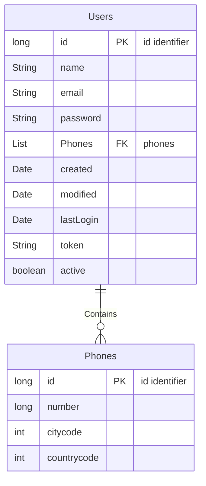
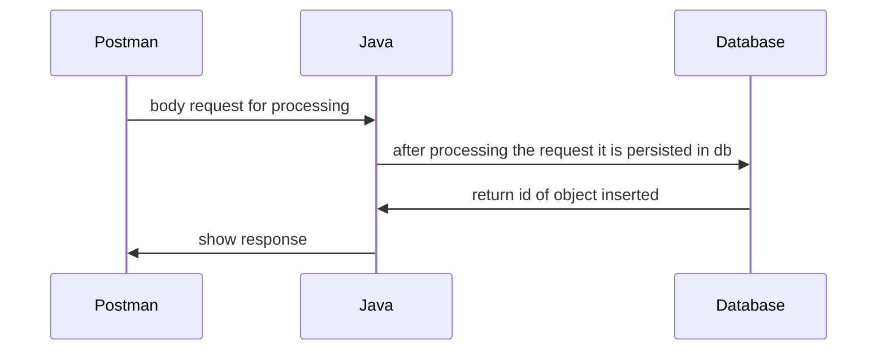
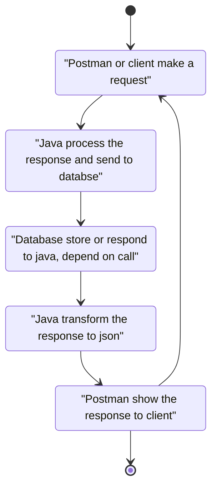

# restServiceApiTest

This repository was created to validate the necessary skills for the creation of rest services in the new **BCI bank** project.

## Deployment

For run application you must mount all code into eclipse IDE, and generate jar file through export menu or just run hitting `ctrl+F11`  

# Postman collection

All detailed information is inside the postman collection

[link](https://documenter.getpostman.com/view/20957797/UzR1JMTN)

For testing services java application must be run under http://localhost:8080

## Passwords security

The security of stored passwords is given only by the strength of the password. The requirements to save a password are:

* a digit must occur at least once
* a lower case letter must occur at least once
* an upper case letter must occur at least once
* a special character must occur at least once
* no whitespace allowed in the entire string
* anything, at least eight places though

## About duplicate emails
It is not allowed to register an email more than once. Not completing this field or sending an invalid email will not allow its registration

## Considerations when updating data

Since it is a basic project, if a field is omitted when updating, it will be left null in the database, so all fields must be sent if possible. The only one that can be omitted is the password
Phones are updated or inserted depending on whether the id exists within the request body, to avoid user insertion errors.

## Table structure
### Class Diagram

All the request are processed in the same route
## UML diagrams

## State Diagram
